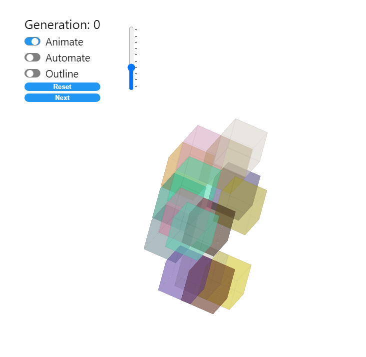

# Microsimulations

A React app that explores **Conway’s Game of Life** and related cellular automata across several implementations: from a classic DOM-based 3D grid to WebGL renderers and a real-world **Boston parcel map** where cells are map parcels and neighbors follow polygon adjacency.

## Demo

https://microsimulations.vercel.app/v1


2020:   



---

## Versions

The app offers four versions in the sidebar dropdown:

| Version | Description |
|--------|-------------|
| **V1 · 2020: DOM** | Original implementation. The simulation runs in the browser with a nested-array strategy. Grid is rendered with DOM (CSS 3D). Good for small to medium grids; DOM does not scale to very large grids. |
| **V2 · 2026: WebGL** | WebGL renderer (React Three Fiber + Three.js) and multiple compute strategies (nested, linear algebra, graph, cached) in a Web Worker. Best for production-style runs at a fixed grid size. |
| **V3 · 2026: ArcGIS** | Boston parcel map. Cells are real parcels; topology is polygon adjacency. Multiple rules (Conway, HighLife, Maze). Step runs in a Web Worker with delta map updates for performance. |
| **V4 · Map (parcels only)** | Same Boston parcel map as V3 but **no algorithm**. Use it to inspect parcel geometry and boundaries only—no simulation, no play/pause, no rule presets. |

---

## Features

- **Two grid renderers (V1/V2):** DOM (CSS 3D) or WebGL (React Three Fiber + Three.js) for better performance on large grids
- **Simulation in a Web Worker** so the UI stays responsive (Comlink)
- Rotate animation, toggle outlines, customize grid size (slider)
- **V2:** Multiple compute strategies (nested, linear algebra, graph, cached) to compare performance
- **V3/V4:** Boston parcel map (Mapbox). V3 runs a cellular automaton on parcel topology; V4 is a work in progress

---

## Get started

### Install and run

```bash
npm i
npm run dev
```

Open [http://localhost:5173](http://localhost:5173) (or the URL Vite prints).

### Scripts

| Script | Description |
|--------|-------------|
| `npm run dev` | Start Vite dev server |
| `npm run build` | Production build |
| `npm run preview` | Preview production build |
| `npm test` | Run tests (Vitest) |
| `npm run parcels-api` | Start mock parcels API (for V3/V4 in dev) |

### Environment (optional)

- **V1/V2:** No env vars required.
- **V3/V4 map:** Set `VITE_MAPBOX_ACCESS_TOKEN` so the Boston map can load. Get a token at [Mapbox](https://www.mapbox.com/). Without it, the map area shows a short message instead of the map.
- **V3/V4 parcels in dev:** Run `npm run parcels-api` in a separate terminal so the app can load parcel GeoJSON from `src/features/boston-map/api/data/`. Optional: `VITE_PARCELS_URL` to override the source; `PARCELS_API_PORT` to change the mock API port (default 3001).

---

## Project structure

The codebase follows a [bulletproof-react](https://github.com/alan2207/bulletproof-react/tree/master/docs)–style layout:

- **`src/app`** — Layout, sidebar, routes, performance bar
- **`src/features/conway`** — Core engine: rules, worker, strategies, simulation hook (no UI)
- **`src/features/grid`** — 2D/3D grid UI (DOM cube, WebGL)
- **`src/features/boston-map`** — Boston parcels API, map components, map simulation hook

See [docs/PROJECT_STRUCTURE.md](docs/PROJECT_STRUCTURE.md) for the full tree and conventions.

---

## Testing

```bash
npm test
```

Tests use Vitest and React Testing Library. Run with `--run` for a single pass or leave the watcher on.

---

## Conway’s Game of Life

[Cellular automaton](https://en.wikipedia.org/wiki/Conway%27s_Game_of_Life) devised by John Horton Conway: cells on a grid are alive or dead; each step, a cell’s next state depends only on its current state and the count of living neighbors. Simple rules yield gliders, blinkers, and complex emergent behavior.

---

## Tech stack

- **React 19**, **Vite**, **TypeScript**
- **React Three Fiber** (v9) + **Three.js** — WebGL grid (V2)
- **Comlink** — Web Worker API for Conway step
- **Mapbox GL** + **react-map-gl** — Boston map (V3/V4)
- **Tailwind CSS**, **Radix UI** primitives (slider, switch, etc.), **lucide-react** icons
- **Vitest** + **Testing Library** — tests
- **Styled Components** — used in legacy/grid styling

---

## Docs

- [Project structure & conventions](docs/PROJECT_STRUCTURE.md)
- [Application references](docs/Application.md)
- [Boston parcels data](src/features/boston-map/api/data/README.md)
